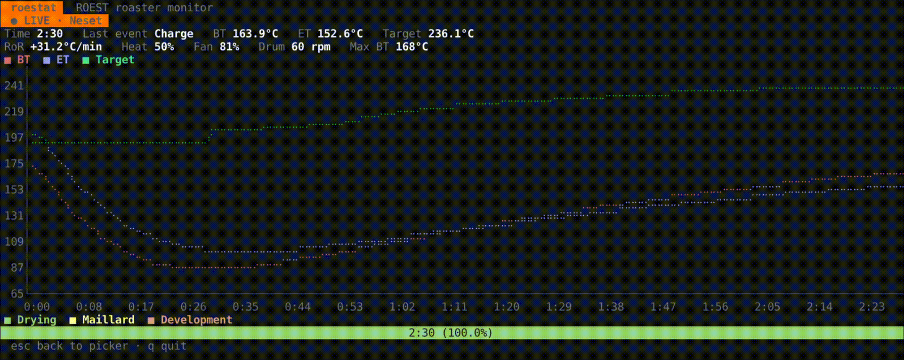

# roestat

A terminal UI for [ROEST](https://roestcoffee.com) sample coffee roasters. Watch
the current roast live and browse your roast history — all from the comfort of
your terminal.

`roestat` is built with [Bubble Tea](https://github.com/charmbracelet/bubbletea)
and talks to the ROEST cloud API: REST for history, MQTT-over-WebSocket for the
live feed.



> **Unofficial.** This project is not affiliated with or endorsed by ROEST. It
> uses ROEST's cloud API, which is undocumented and may change at any time.

## Features

- **Live view** — a real-time dashboard of the current roast: bean/environment
  temperature, target, Rate of Rise, heat/fan/drum, elapsed time and last event,
  a live temperature curve, and a drying/Maillard/development phase bar that
  grows as the roast advances. If you open it mid-roast, the curve is backfilled
  from the datapoints collected so far, then continues live.
- **History view** — a browsable table of past roasts (batch, bean, date,
  duration, weight loss, first-crack temp) with lazy pagination.
- **Roast detail** — select any past roast to see summary stats, a
  drying/Maillard/development phase bar (duration and share of each), and its
  full temperature and Rate-of-Rise curves.

Rate of Rise is computed client-side (over a 30s window), since the live feed
doesn't include it. Temperatures show in °C by default; press `f` to switch
every gauge, chart, and table between °C and °F.

## Install

Requires Go 1.24+.

```sh
go install github.com/yuedongze/roestat@latest
```

Or build from source:

```sh
git clone https://github.com/yuedongze/roestat.git
cd roestat
go build -o roestat .
```

## Configuration

`roestat` reads credentials from the environment (or a local `.env` file — see
[`.env.example`](.env.example)):

| Variable             | Required | Description                                                        |
| -------------------- | -------- | ------------------------------------------------------------------ |
| `ROEST_CLIENT_ID`    | yes      | OAuth2 client ID for the ROEST API.                                |
| `ROEST_CLIENT_SECRET`| yes      | OAuth2 client secret.                                              |
| `ROEST_CUSTOMER_ID`  | no       | Your customer ID. Auto-detected from your account if not set.      |

Credentials use the OAuth2 client-credentials grant. Your `client_id` is listed
by the API's `/applications/` endpoint. See [`docs/roest-api.md`](docs/roest-api.md)
for API details.

Never commit your real `.env` — it's already in `.gitignore`.

## Usage

```sh
roestat
```

Keybindings:

| Key        | Action                                  |
| ---------- | --------------------------------------- |
| `↑` / `↓`  | Move selection                          |
| `enter`    | Open roast details (history)            |
| `l`        | Open the live view (pick a machine)     |
| `/`        | Filter machines (in the picker)         |
| `f`        | Toggle temperatures between °C and °F    |
| `esc`      | Back                                    |
| `q`        | Quit                                    |

## Development

```sh
go test ./...   # includes a headless render test of every view
go vet ./...
```

## License

[MIT](LICENSE)
